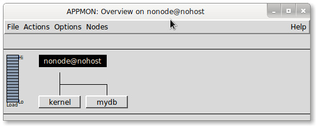
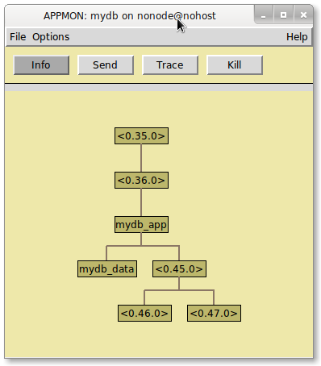
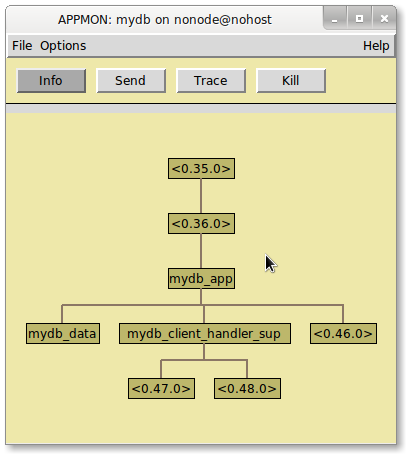

=============
 e2 Tutorial
=============

e2 lets you use Erlang to build better quality software in less time. This
tutorial guide will walk you through an example of that process.

We're done with "hello world" examples here -- that's way too easy. Let's shoot
for something more interesting...

A database server!

Of course, there are hundreds of ready made databases we could use "off the
shelf". Why tackle the hard problem ourselves?

Aside from the fact this is a tutorial and we'll learn a lot, sometimes it just
makes sense to build something yourself.

The *build* vs. *buy* consideration is as old as the software industry
itself. The explosion of quality open source software gives us even more *buy*
options (even if we're not paying for licenses). Changes are good that you'll
find something on github that is close to meeting your needs.

The problem with buy options has always been that you're taking a solution to
someone else's problem and applying it to your own. You must often adapt the
off-the-shelf component to meet your needs -- or, worse, adapt your needs to
the software!

In this tutorial example, we'll demonstrate how you can use Erlang to build a
solution to your problem -- it will contain no more or no less functionality
than we need.

Problem Definition
==================

The single most important step in software development is understanding what
your problem is. In fact, that's the real problem! Developers too often start
working on a solution without having a clear idea of what they're solving.

Let's not make that mistake!

Of course, this is an example, so we can make up any problem and be 100%
correct! But let's at least make it sound good.

In this example, we'll let multiple clients store and retrieve strings. We also
want to perform special validation on values before they're stored. We could
use something like stored procedures in a relational database to implement
this, but let's see how far we get with something very simple and direct.

Here's what we're looking for:

- Write values that can be subsequently read using a key
- Ensure that illegal values aren't written
- Support multiple connected clients over a TCP network
- Data should survive application restarts or crashes [#durability]_

With that problem sketch, let's get started!

Setting Up e2
=============

.. note:: If you've already setup e2 from :doc:`quick_start`, you can skip this
   section. References to ``E2_HOME`` in this tutorial refer to the root
   directory of you local e2 clone.

First, retrieve e2 from github::

   $ git clone git://github.com/gar1t/e2.git

Note the e2 directory -- we will refer to this as ``E2_HOME`` in examples. If
you want to copy-and-paste the examples, export the environment variable::

   $ export E2_HOME=<e2 directory>

Compile e2::

   $ cd $E2_HOME
   $ make

Create an Empty e2 Project
==========================

From ``E2_HOME`` use the ``new-project`` make target to create a new project
skeleton. We'll call our application "mydb" [#mydb]_.

::

   $ cd $E2_HOME
   $ make new-project appid=mydb appdir=~/e2-tutorial

Compile your new project::

   $ cd ~/e2-tutorial
   $ make

Run your project in an Erlang shell::

   $ make shell

You can leave this shell running to experiment with your application as you
build it!

Developer Workflow
==================

The most typical e2 workflow looks like this:

- Use a text editor to create and modify Erlang source files
- Run the ``make`` or ``make quick`` commands to compile changes
- Experiment with your modules in the Erlang shell

The e2 makefile's ``shell`` target runs an Erlang shell with ``e2_reloader``
started [#e2_reloader]_. ``e2_reloader`` watches for changes in your compiled
modules and automatically reloads them. It makes iterative development very
easy!

Let's take this workflow for a test drive!

Open the ``mydb.erl`` module and modify the ``stop`` function from this:

.. code-block:: erlang

   stop() ->
       application:stop(mydb).

to this:

.. code-block:: erlang

   stop() ->
       io:format("### stopping mydb~n"),
       application:stop(mydb).

Save you changes and compile them by running the ``make quick`` command
[#make_quick]_::

   $ make quick

This will recompile any modified modules, which in turn will be reloaded (if
need be) in the shell.

Test your change in the shell:

::

   > mydb:stop().
   ### stopping mydb
   {error,{not_started,mydb}}

You get an error because the ``mydb`` application isn't started. That's okay --
this is just an illustration of developer workflow.

Here we used `io:format/1`_ to print something to the shell -- as it turns out,
that's a very useful way to debug your applications!

Let's revert that change by deleting the ``io:format("### stopping mydb~n"),``
line and recompiling.

Note that the change is automatically reflected in your Erlang shell:

::

   > mydb:stop().
   {error,{not_started,mydb}}

Building a Database Server - Where to Start?
============================================

Now that we have a project up and running, we can start to tackle our
problem. But where do we start?

When faced with a hard problem, it's a good idea to look for smaller problems
that are easier to solve.

Without thinking at all about how the pieces should fit together, let's jot
down some information that we're fairly certain of. We don't need to get it all
right -- let's just think out loud:

- We need a way to store the key/value pairs on disk and retrieve them
- We need something to listen to a TCP socket and handle client connections

Anything else?

Who cares! That's certainly enough to get started. We could spend ages
perfecting a design, or dive right in, solve easy problems by experimentation,
and worry about the rest after we've made some progress.

Storage Engine
==============

If we're going to store strings values and associate them with keys, we'll need
some sort of storage engine.

While we could be really ambitious and write our own, Erlang happens to have
something that we can start with -- the `dets module`_.

Take a moment to scan through the documentation on ``dets``. This may also be a
good time to glance over the :doc:`list of frequently used modules
<erlang_modules>`. Erlang is a language with "batteries included" and it will
help you to know what's available.

There's a lot of detail in the ``dets`` module -- let's sketch out what we
might need before doing a deep dive:

- Write a keyed value
- Retrieve a value with a key
- Delete a keyed value
- Manage concurrent access

The last point comes up because we want to let more than one client access the
database at the same time.

Note the statement in the ``dets`` documentation:

  *[The] Mnesia application (or some user implemented method for locking) has
  to be used to implement safe concurrency.*

This is good to know! We'll need to consider this when accessing any ``dets``
files.

Data Access API
===============

With your editor, create the file ``~/e2-tutorial/src/mydb_db.erl`` as follows:

.. literalinclude:: ../examples/mydb/src/mydb_db.part.1
   :language: erlang

This is our basic data API. Let's implement one function at a time.

Creating a New Data File
------------------------

Looking through the documentation, it looks like `dets:open_file/2`_ is what we
need for both creating and opening an data file.

Update the ``open/1`` function to look like this:

.. literalinclude:: ../examples/mydb/src/mydb_db.part.2
   :language: erlang
   :lines: 5-6

That sure looks simple! As it turns out -- the default options for
opening/creating the dets file should work for our application.

Inserting New Items
-------------------

It's looks like we want the `dets:insert/2`_ function for adding values to a
``dets`` file.

Modify our ``put/3`` function to look like this:

.. literalinclude:: ../examples/mydb/src/mydb_db.part.2
   :language: erlang
   :lines: 8-9

Also very simple!

Retrieving Items
----------------

``dets`` provides a dizzying array of lookup functions. Fortunately, our case is
very simple -- we can use `dets:lookup/2`_.

``get/2`` should now look like this:

.. literalinclude:: ../examples/mydb/src/mydb_db.part.2
   :language: erlang
   :lines: 11-12

Deleting Items
--------------

Our last function will use `dets:delete/2`_:

.. literalinclude:: ../examples/mydb/src/mydb_db.part.2
   :language: erlang
   :lines: 14-15

Testing the API
---------------

Compile your changes and, assuming there are no errors, let's try some database
operations!

In your running Erlang shell:

::

   > {ok, Db} = mydb_db:open("/tmp/test.db").
   {ok,"/tmp/test.db"}

This operation should have created the file ``/tmp/test.db``.

You can use `file:read_file_info/1`_ within the Erlang shell to confirm.

::

   > rr(file).
   [file_descriptor,file_info]
   > file:read_file_info("/tmp/test.db").
   {ok,#file_info{...}}

The function ``rr/1`` is used to load Erlang record definitions into the shell
[#rr]_.

Now let's have some fun!

::

   > mydb_db:put(Db, "msg", "Erlang is fun!").
   ok
   > mydb_db:get(Db, "msg").
   [{"msg","Erlang is fun!"}]
   > mydb_db:del(Db, "msg").
   ok
   > mydb_db:get(Db, "msg").
   []

If you happened to mis-type something and get an error, you'll notice that
subsequent uses of ``Db`` cause a strange error.

Let's make a mistake::

   > mydb_db:get(Db2, "msg").
   * 1: variable 'Db2' is unbound

And correct it::

   > mydb_db:get(Db, "msg").
   ** exception error: bad argument
        in function  dets:lookup/2
           called as dets:lookup("/tmp/test.db","msg")

This is a not-so-obvious, but very useful feature in Erlang! Alas, the details
are out of scope for this tutorial.

When this happens, you can re-create the ``Db`` variable this way: [#reassign]_

::

   > {ok, Db} = mydb_db:open("/tmp/test.db").

Refining the API
----------------

So far, we have a way to store and retrieve string values!

But our API is a bit strange:

- When we read our sample value, we got ``[{"msg","Erlang is fun!"}]`` -- that
  might make sense for ``dets:lookup/2`` but it's a bit odd for our case
- The "missing" value was ``[]`` -- also odd

Other than that, the API looks pretty good.

Let's fix these two oddities by applying a standard Erlang pattern: we want a
way to differentiate "I have a value" from "I don't have a value". This is
typically done using Erlang atoms as follows:

``{ok, Value}``
  Indicates that we got a value

``error``
  Indicates that we didn't get a value

This pattern is used by `dict:find/2`_ [#api_consistency]_.

Let's modify ``mydb_db:get/2`` to use a result handler -- the handler will be
responsible for translating the result from ``dets:lookup/2`` to something more
appropriate for our case.

.. literalinclude:: ../examples/mydb/src/mydb_db.erl
   :language: erlang
   :lines: 11-12

And add ``handle_dets_lookup/1`` to the module:

.. literalinclude:: ../examples/mydb/src/mydb_db.erl
   :language: erlang
   :lines: 17-18

Recompile your changes and test the new behavior::

   > mydb_db:put(Db, "msg", "Erlang is elegant!").
   ok
   > mydb_db:get(Db, "msg").
   {ok, "Erlang is elegant!"}
   > mydb_db:del(Db, "msg").
   ok
   > mydb_db:get(Db, "msg").
   error

Nice!

What About ``case``?
--------------------

We could have written ``get/2`` this way:

.. code-block:: erlang

   get(Db, Key) ->
       case dets:lookup(Db, Key) of
           [{_Key, Value}] -> {ok, Value};
           [] -> error
       end.

Why did we use a "handler" function instead?

Any case statement can be translated into a function -- and, in most cases,
that's probably the better approach. A function lets you formalize the
operation. For one, you need to answer the question, "what am I going to call
this silly thing?" That process alone is helpful -- naming things is hard, but
good names help clarify what's going on.

You may also find the "case" worthy of a function if it becomes complex
enough.

Of course, you're perfectly free to use case statements. But you at least feel
a little guilty -- you're missing a great chance to clarify what you're doing
with a well defined function!

Client Access
=============

Now that we have a way to store and retrieve values, wouldn't it be nice to let
clients access this great functionality?

But how?

We've already stated that we want clients to access our database over
TCP/IP. We could, for example, run an HTTP server and provide a `REST`_
interface for clients.

But why do that? TCP isn't that hard after all. And we can use ``telnet`` to
test!

Let's imagine for a moment a hypothetical ``telnet`` session with our database
server, running locally on port 1234. In the sample session below, lines
preceded with ">> " are lines you would type followed by ENTER and the rest are
lines that telnet prints. The ``^`` character indicates the CTRL character is
held down when typing the following character.

Again, this is only a hypothetical "what it might look like"::

   $ telnet 127.0.0.1 1234
   Trying 127.0.0.1...
   Connected to 127.0.0.1.
   Escape character is '^]'.
   >> PUT msg Erlang gives you mad skills
   +OK
   >> GET msg
   +Erlang gives you mad skills
   >> DEL msg
   +OK
   >> GET msg
   -ERROR
   >> ^]
   >> quit
   Connection closed.

This is a rough sketch, but you get the idea:

- Commands are sent on a single line (i.e. a series of bytes terminated by
  "\\r\\n")
- Results are prefixed with "+" -- errors are prefixed with "-"

Database Server Stub
====================

Let's not think too much here -- we know that we need to parts here:

- Something listening on a TCP port for incoming client connections
- Something to handle client connections

Each of these "somethings" maps to an :doc:`e2 task <tasks>`. Tasks are single
minded processes -- they perform some work and stop, or, if need be, start the
work again.

In the case of the "listener", we want a task that binds to a local port, waits
for a connection, starts a handler for that connection, and resumes the process
of waiting for another connection.

In the case of the "handler", we want a task that interacts with a client
connection until that connection is closed or there's an error.

Database Server Listener
========================

Create the file ``~/e2-tutorial/src/mydb_server.erl``:

.. literalinclude:: ../examples/mydb/src/mydb_server.part.1
   :language: erlang

Whoa -- that's a lot of code!

Before we break it down, let's try it. First, compile your changes. Then run
the following in the Erlang shell::

   > {ok, Server} = mydb_server:start_link(1234).
   {ok, <0,XX,0>}

And... wait for it...

::

   TODO: dispatch client fake_client_socket
   TODO: dispatch client fake_client_socket
   ...

This will continue running, simulating the client dispatch process, until we
stop it. Let's terminate our task:

::

   > exit(Server, shutdown).
   ** exception exit: shutdown

We now have a "listener" that doesn't really listen to anything -- but it does
stub out the functionality we want. Let's look more closely.

Task Behavior
-------------

We know our listener is a `task` because it says so:

.. literalinclude:: ../examples/mydb/src/mydb_server.part.1
   :language: erlang
   :lines: 3

Not only does this tell us what sort of module we have, it tells the Erlang
compiler to warn us if we don't export certain functions -- in this case, we
need to export ``handle_task/1``.

Task Exports
------------

We took the trouble to create two lists of exports for our module:

.. literalinclude:: ../examples/mydb/src/mydb_server.part.1
   :language: erlang
   :lines: 5-7

We didn't need to do this -- but it's a common pattern in Erlang to list
*public API* exports separately from *behavior callbacks*. In our handler task,
``start_link/1`` is meant for public consumption, which ``init/1`` and
``handle_task/1`` are callbacks that are used by ``e2_task`` [#callbacks]_.

Starting the Task
-----------------

``start_link/1`` is called to start our server. It takes one argument -- the
port to listen on.

As a behavior callback module, ``mydb_server`` delegates *start* to its
behavior module -- in this case ``e2_task``.

.. literalinclude:: ../examples/mydb/src/mydb_server.part.1
   :language: erlang
   :lines: 9-10

Here we provide the callback module ``?MODULE``, which is an alias for the
``mydb_server``, and the port we want to listen on. The module will be used
when calling functions like ``init/1`` and ``handle_task/1``. The port will be
used as an argument to ``init/1``.

Initializing the Task
---------------------

``init/1`` is used to listen on the specified port:

.. literalinclude:: ../examples/mydb/src/mydb_server.part.1
   :language: erlang
   :lines: 12-13

The init result defines the initial task *state*, which is used in the first
call to ``handle_task/1``.

What's the point of a separate *init* phase -- why not consolidate the startup
logic in the "start" function?

This is a nuanced point that gets to the heart of Erlang's application
architecture: functions are called in the context of *processes*. Sometimes
functions are called in the context of a *client* process -- and sometimes
they're called in the context of a *server* process.

It's important to understand and recognize this distinction.

``start_link/1`` is called in the context of the client process. ``init/1`` is
called in the context of the server process. A general rule in Erlang is this:
processes are black boxes -- you start them and they run. All the grimy details
associated with the process are performed by the process -- and die with the
process. Other processes aren't affected.

This is a deeper topic that you'll understand thoroughly over time. But in the
limited scope of this tutorial, understand that you want to perform any risky
or complex process initialization in ``init/1``.

Handling Client Connections
---------------------------

As soon as our server is initialized, it *handles* incoming client
connections.

.. literalinclude:: ../examples/mydb/src/mydb_server.part.1
   :language: erlang
   :lines: 15-17

The declarative nature of Erlang makes this very clear: you handle a client
connection by waiting for one, then dispatching it. Then you repeat.

Neat!

The rest of the module is "fake" -- we wanted to stub this out so we can get a
feel for the server behavior. The next step is to implement the missing
functionality.

Listening for Clients
---------------------

Servers that listen for incoming TCP connections on a particular port can use
Erlang's ``gen_tcp`` module. Here's the modified version of our ``listen/1``
function:

.. literalinclude:: ../examples/mydb/src/mydb_server.part.2
   :language: erlang
   :lines: 19-21

This function will open a listen socket on the specified Port.

Refer to `gen_tcp:listen/2`_ for more details.

Waiting for Client Connections
------------------------------

Once our server is listening on the specified port, it can wait for incoming
client connections using `gen_tcp:accept/1`_. Here's the modified version of
our ``wait_for_client/1`` function:

.. literalinclude:: ../examples/mydb/src/mydb_server.part.2
   :language: erlang
   :lines: 23-25

This function will block until a client establishes a TCP connection with our
server port. It's okay to block here -- the server is a *task*, which means
it runs in a separate process. It can happily block, waiting for connections,
while other Erlang processes run free!

Testing The Server
------------------

Now that our server can listen to a port and accept incoming client
connections, let's test it!

Start a new server in your running Erlang shell: [#s2]_

::

   > {ok, S2} = mydb_server:start_link(1234).

.. note:: If you made a mistake and something went wrong, don't fear! The
   easiest way to get back to a clean slate is to exit the shell by typing
   ``CTRL-C`` twice and restarting it using ``make shell``. Then re-type what
   you missed above.

If everything went according to plan, you're server is actually listening on
port 1234!

Test the server using ``telnet``::

   $ telnet 127.0.0.1 1234

In your Erlang shell, note the output::

   TODO: dispatch client #Port<0.XXX>

Your server is dealing with real life client connections! Only it's not -- we
still have to implement that part.

Close your ``telnet`` session [#close_telnet]_.

Client Handlers
===============

Now that we're accepting client connection, let's create something to handle
them!

We want another task type -- we want to interact with clients until they close
the connection or there's an error.

Create the file ``~/e2-tutorial/src/mydb_client_handler.erl``:

.. literalinclude:: ../examples/mydb/src/mydb_client_handler.part.1
   :language: erlang

Like our initial server, this task stubs out the functionality we want. Instead
of providing database services, it prints a snarky messages and closes the
connection.

Using the Handler
-----------------

To see this new task in action, we need to start it when we get a new client
connection. It's easy!

In ``mydb_server.erl``, modify ``dispatch_client/1`` as follows:

.. literalinclude:: ../examples/mydb/src/mydb_server.part.2
   :language: erlang
   :lines: 27-28

Compile your changes.

Now when we get a new client connection, we'll start a task to handle it.

Before we can test this, we need to stop our running server -- we left some
client connections in a wait state by not closing them explicitly in our
previous iteration. In the Erlang shell, stop the server this way::

   > exit(S2, shutdown).
   ** exception exit: shutdown

Now we can start a new server::

  > {ok, S3} = mydb_server:start_link(1234).
  {ok,<0.XX.0>}

Let's see what happens now when we connect using ``telnet``::

   $ telnet 127.0.0.1 1234
   Trying 127.0.0.1...
   Connected to 127.0.0.1.
   Escape character is '^]'.
   hello, and goodbye!
   Connection closed by foreign host.

Well!

Client Handler Stub
-------------------

So far, this process has been very iterative -- we start with something small,
see if it works, then enhance it until we get what we want.

In that tradition, let's modify our client handler just enough to get a feel
for a client interaction.

In ``mydb_client_handler.erl`` modify ``handle_task/1`` as follows:

.. literalinclude:: ../examples/mydb/src/mydb_client_handler.part.2
   :language: erlang
   :lines: 12-13

We're using two yet-to-be-defined functions: ``read_line/1`` and
``handle_command_line/2``. This illustrates how functions can be used to
symbolically represent your problem/solution. This is a single line function
that makes it absolutely clear what it means to handle a "client task". We
don't yet know what it means to "handle a command line", but we know -- or more
accurately, we're *declaring* -- that the task is to handle a single command,
which is derived from a single line read from a socket.

Let's define the two missing functions. First ``read_line/1``:

.. literalinclude:: ../examples/mydb/src/mydb_client_handler.part.2
   :language: erlang
   :lines: 15-17

This is standard TCP network programming: we're setting socket options and
reading some data. You can read about socket options in `inet:setopts/2`_

Next, let's stub out some basic command handling support in
``handle_command_line/2``:

.. literalinclude:: ../examples/mydb/src/mydb_client_handler.part.2
   :language: erlang
   :lines: 19-23

This function handles two cases:

- If we get data from a client, print it so we can see what it looks like
- If we get an error, stop the task with an error condition (we'll see in a
  moment what this looks like)

Now let's test the behavior using ``telnet``.

.. note:: Lines prefixed by ``>>`` below indicate text that you should
   type, followed by ``ENTER``. For example, when you see ``>> GET msg`` type
   ``GET msg`` and then press ``ENTER`` If you don't see ``>>`` your version of
   telnet may be using a different prompt, or no problem at all. In this case,
   just type what follows ``>>`` and press ``ENTER``.

::

   $ telnet 127.0.0.1 1234
   Trying 127.0.0.1...
   Connected to 127.0.0.1.
   Escape character is '^]'.
   >> GET msg
   >> PUT msg This is a test message
   >> DEL msg
   >> ^]
   >> quit
   Connection closed.

Note what happened in your Erlang shell::

   ### Got "GET msg\r\n" from client
   ### Got "PUT msg This is a test message\r\n" from client
   ### Got "DEL msg\r\n" from client
   >
   =ERROR REPORT==== 25-Mar-2012::12:28:01 ===
   ** Generic server <0.45.0> terminating
   ...
   ** Reason for termination ==
   ** {socket_err,closed}

We can see our commands very clearly represented as Erlang strings. That should
be pretty easy to handle!

When we closed the client telnet session, we got a big error. We can see that
the *reason* for the error was that the socket was closed.

We'll use this information in the next step to better handle these cases.

More Client Handler
-------------------

Now that we know what to expect from client connections, let's think about what
sort of functionality we need:

- We need to handle specific commands
- To handle specific commands, we'll need to parse the command line
- We should gracefully handle the case when the socket is closed by the client
  -- let's just stop the task normally

Here's the new ``handle_command_line/2`` function:

.. literalinclude:: ../examples/mydb/src/mydb_client_handler.part.3
   :language: erlang
   :lines: 19-22

As with ``handle_task/2``, this function is short and clearly communicates the
logic of handling a command line.

Let's fill in some more!

Our command parsing is pretty simple. Commands look like this::

   <COMMAND> SPACE <ARGUMENT> CRLF

We can use Erlang's excellent regular expression support for this. Add the
these new functions to ``mydb_client_handler.erl``:

.. literalinclude:: ../examples/mydb/src/mydb_client_handler.part.3
   :language: erlang
   :lines: 24-29

For more information on the options used, see `re:run/3`_.

Note that we again used a *handler* function to translate the results of
``re:run/3`` to something appropriate for our use. We could easily have used a
case statement -- but the function more formally represents our logic.

Next, we need to handle specific commands. Based on our design sketch above, we
support "GET", "PUT" and "DEL". Anything else is an error.

Here's what ``handle_command/2`` looks like:

.. literalinclude:: ../examples/mydb/src/mydb_client_handler.part.3
   :language: erlang
   :lines: 31-38

This is the heart and soul of the task -- it takes input from the user,
performs the appropriate action, and routes the reply back to the user.

Note that "PUT" is slightly different from the other operations -- it treats
the single argument as both a key and a value.

Here's the logic that breaks that single value into two:

.. literalinclude:: ../examples/mydb/src/mydb_client_handler.part.3
   :language: erlang
   :lines: 40-44

Just two more parts to go!

- db_xxx functions, which handle the database operations
- Reply handler, which encodes our responses and sends them to the client

Here are some stubs for the database operations -- we'll figure out those
details later:

.. literalinclude:: ../examples/mydb/src/mydb_client_handler.part.3
   :language: erlang
   :lines: 46-53

We already have the database support -- so plugging this in later will be easy!

Finally, here's the logic for handling replies:

.. literalinclude:: ../examples/mydb/src/mydb_client_handler.part.3
   :language: erlang
   :lines: 55-57

You're probably sick of these short, trivial functions that use other short,
trivial functions!

Let's take a moment to review why we write code this way:

- Short, trivial functions are easier to read and understand
- Short, trivial functions usually solve trivial problems
- Trivial problems are easy to solve!

The real problem is of course finding problems that are trivial. Most problems
in software are initially hard. But by working to break the problems into
smaller, integral sub problems, we can eventually get to the point we're
just solving those elusive easy ones!

That's exactly what we've been doing here in building a database. By
systematically thinking about concrete, solvable problems, we slowly but surely
chain together trivial solutions that add up to something quite complex.

Confucius say, "Enough philosophy -- let's finish our code already!"

Here's the last piece of our nearly finished task module:

.. literalinclude:: ../examples/mydb/src/mydb_client_handler.part.3
   :language: erlang
   :lines: 59-64

This function handles three cases:

- Sending a value
- Sending an "OK"
- Sending an "ERROR"

We've made a lot of changes in this round, so here's the complete module as it
stands currently.

.. literalinclude:: ../examples/mydb/src/mydb_client_handler.part.3
   :language: erlang

Compile the changes and let's test them with ``telnet``.

We need to restart the server because of the error from our last test. In your
running Erlang shell, run::

   > {ok, S4} = mydb_server:start_link(1234).

Using ``telnet``, let's connect to our server and try out some commands. As
before, lines starting with ``>>`` represent commands that you type,
followed by ``ENTER``.

::

   $ telnet 127.0.0.1 1234
   Trying 127.0.0.1...
   Connected to 127.0.0.1.
   Escape character is '^]'.
   >> GET msg
   +You asked for msg
   >> PUT msg hello
   +OK
   >> DEL msg
   +OK
   >> BAD_CMD
   -ERROR
   >> ^]
   >> quit
   Connection closed.

Wow! Aside from the fact that our values aren't stored or retrieved, this is a
pretty cool database!

Data Access
============

Without thinking too hard about this, how would we implement the ``db_xxx``
functions in ``mydb_client_handler``?

Let's grab our example code from earlier and just paste into one of the
functions -- just to see what it would look like:

.. code-block:: erlang

   db_get(Key) ->
       mydb_db:get(Db, Key).

That looks perfect! Except that ``Db`` isn't defined. How are we going to solve
this? Erlang, after all, doesn't have global variables -- we can't just write
to a shared heap and grab a reference to our database!

There are two ways to deal with this:

- When a client handler process is started using
  ``mydb_client_handler:start_link``, specify a database reference as an
  additional argument
- Run a registered database service within the application

This is a legitimate design consideration -- either approach is valid and would
work. Let's think through the issues.

- If we added a ``Db`` argument to ``mydb_client_handler:start_link``, we're
  making it slightly harder to start a handler task. Generally, in Erlang, you
  want to make it easier to start processes, not harder.

- The database file is a shared resources -- if we let each task have direct
  access to it, we might run into concurrency related problems.

- Since e2 is "service oriented", maybe creating a separate data access
  *service* won't be that hard. Hmmm.

Registered services are Erlang's equivalent of `singletons`_. This is really
what we want -- something that's "just there" that we can use. Our code could
then look like this:

.. code-block:: erlang

   db_get(Key) ->
       mydb_data:get(Key).

Data Server
===========

Building services in e2 is easy.

Create the file ``~/e2-tutorial/src/mydb_data.erl``:

.. literalinclude:: ../examples/mydb/src/mydb_data.erl
   :language: erlang

We'll take some time to go over each part of this module in detail, but first,
let's test it!

Compile the code and start a server in your running Erlang shell::

   > mydb_data:start_link("/tmp/test.db").
   {ok,<0,XX,0>}

Now try some database operations::

   > mydb_data:del("msg").
   ok
   > mydb_data:get("msg").
   error
   > mydb_data:put("msg", "My database is nigh!").
   ok
   > mydb_data:get("msg").
   {ok, "My database is nigh!"}

Provided we can start this service, our client handlers can use this API
without worrying about a ``Db`` reference. This is the value of a *service* --
as long as it's running, just use it!

Let's take a moment to review this new service of ours.

Service Behavior
----------------

We know our data service is a *service* because it says so:

.. literalinclude:: ../examples/mydb/src/mydb_data.erl
   :language: erlang
   :lines: 3

As with the ``e2_task`` behavior declaration, it not only helps us understand
the type of module, it tells the Erlang compiler to check for required
functions. In this case, we need to export ``handle_msg/3``.

Service Exports
---------------

We see here the separate listing of *public* functions and *callback*
functions.

.. literalinclude:: ../examples/mydb/src/mydb_data.erl
   :language: erlang
   :lines: 5-7

Starting the Service
--------------------

The ``start_link`` function is used to start the service. It's similar to that
of ``mydb_client_handler``, but it applies to ``e2_service`` types, rather than
``e2_task`` types.

Note the additional ``registered`` option provided in the third argument. This
tells e2 to register the service using its module name. This can be used to
make calls to the registered process -- we'll see how this works when we look
more closely at the *public API* functions below.

.. literalinclude:: ../examples/mydb/src/mydb_data.erl
   :language: erlang
   :lines: 9-10

Initializing the Service
------------------------

Our service provides access to a single database. We open this database as a
part of the *service initialization*. This is what we did manually when we
experimented with the ``mydb_db`` module -- we first opened a database and then
worked with that reference to test the operations.

In this case, we'll open the database and use that value as our initial service
*state*.

.. literalinclude:: ../examples/mydb/src/mydb_data.erl
   :language: erlang
   :lines: 21-22

If you recall, ``init/1`` is called in the context of the *server* process --
not the process that called ``start_link``. This is subtle, but important -- if
something goes wrong during initialization, the caller of ``start_link`` won't
be affected because of Erlang's process isolation guarantees.

Public API
----------

The public API is used by client of the service. These functions are called in
the context of *client* processes -- not the server process.

Each public API function looks similar:

- Use ``e2_service:call/2`` to send a message to the server process
- ``?MODULE`` refers to the registered service (an alias for ``mydb_data`` in
  this case)

.. literalinclude:: ../examples/mydb/src/mydb_data.erl
   :language: erlang
   :lines: 12-19

If we had not registered the process when we created it, we would have required
an explicit process reference. Because the process is registered, we can use
its registered name instead. This is how you can provide "global" or
"singleton" style processes in your Erlang applications.

We'll see later how to automatically start services when your application
starts.

Handling Messages
-----------------

The public API functions use ``e2_service:call/2`` to send messages to the
registered service. The service process *handles* these messages in
``handle_msg/3``.

You can see each of the three message sent by the public API functions handled here:OB

.. literalinclude:: ../examples/mydb/src/mydb_data.erl
   :language: erlang
   :lines: 28-33

Our service "serves" access to a single database (opened in ``init/1`` and
passed as the third argument to ``handle_msg/3``). Each of the three
operations, ``get``, ``put``, and ``del`` are trivially passed along to the
``mydb_db`` module.

Using the Data Service
======================

We're only moment away from connecting the dots to get a functional database!

Modify the three ``db_xxx`` functions in ``mydb_client_handler.erl`` to look
like this:

.. literalinclude:: ../examples/mydb/src/mydb_client_handler.erl
   :language: erlang
   :lines: 46-53

Compile your changes and get ready for some fun!

::

   $ telnet 127.0.0.1 1234
   Trying 127.0.0.1...
   Connected to 127.0.0.1.
   Escape character is '^]'.
   >> DEL msg
   +OK
   >> GET msg
   -ERROR
   >> PUT msg It is alive!
   +OK
   >> GET msg
   +It is alive!
   >> ^]
   >> quit
   Connection closed.

High five!

Putting It All Together
=======================

We actually have a bona fide, multi-client, socket based database server!

But we still have some work ahead of us. To illustrate, we're going to shut
down the Erlang VM and rebuild our various services.

Shut down the Erlang shell by typing CTRL-C twice (^C ^C).

Restart the shell::

   $ make shell

Let's try to connect using our ``telnet`` client::

   $ telnet 127.0.0.1 1234
   Trying 127.0.0.1...
   telnet: Unable to connect to remote host: Connection refused

There's no server running! Let's start one in the Erlang shell::

   > mydb_server:start_link(1234).

Try connecting with ``telnet`` again::

   $ telnet 127.0.0.1 1234
   Trying 127.0.0.1...
   Connected to 127.0.0.1.
   Escape character is '^]'.

We're in!

In the ``telnet`` session, "GET" a value::

   >> GET msg
   Connection closed by foreign host.

Something bad! Check the Erlang shell -- you'll see an error report that looks
something like this::

   =ERROR REPORT==== 25-Mar-2012::17:19:37 ===
   ** Generic server <0.38.0> terminating
   ...
   ** exception error: {noproc,
                         {gen_server,call,
                            [mydb_data,{'$call',{get,"msg"}},infinity]}}

This is fancy Erlang speak for "the process you tried to call wasn't running!"

The problem is that our client handler relies on ``mydb_data`` to be
started. But we never started it!

That's the nature of service oriented design -- to use a service, it must be
running. If it's not running, you can't use it.

Let's fix this by stating the data service. In the Erlang shell, run::

   > mydb_data:start_link("/tmp/data.db").

We also have to start our server again, because it crashed when the handler
crashed. In the Erlang shell::

   > mydb_server:start_link(1234).

Now connect again with ``telnet`` and experiment with the socket protocol.

It works!

But if only there was a way to do all this startup work automatically.

Application Startup
-------------------

In your editor, open the file ``~/e2-tutorial/src/mydb_app.erl``.

This file was created automatically when you created the ``mydb`` project.

It even has a little TODO note for you!

The purpose of this module is to list top-level processes that are started when
the application starts. Perfect!

Modify the file to look like this:

.. literalinclude:: ../examples/mydb/src/mydb_app.part.1
   :language: erlang

This tells e2, when you start the ``mydb`` application, make sure that
``mydb_server`` and ``mydb_data`` are started.

Compile you changes and let's test!

Shut down Erlang by typing CTRL-C twice.

Restart it::

   $ make shell

In the Erlang shell, start ``mydb``::

   > mydb:start().
   ok

Now test the database server using ``telnet``.

You can also execute ``mydb:stop().`` to stop the database and confirm that the
server is no longer running.

Application Configuration
-------------------------

Our database is looking great! But we have a problem -- we hard coded some
settings in ``mydb_app``:

- The database file is "/tmp/test.db"
- The server port is 1234

Those values are fine for testing, but we need to support external
configuration to let database administrators setup the database on differently.

Replace the hard coded port and file name in ``mydb_app:init/0`` with some
functions -- we can use these to lookup the values:

.. literalinclude:: ../examples/mydb/src/mydb_app.part.2
   :language: erlang
   :lines: 10-13

Next, add the two functions -- these in turn lookup application configuration:

.. literalinclude:: ../examples/mydb/src/mydb_app.part.2
   :language: erlang
   :lines: 15-19

``?DEFAULT_DB_FILE`` and ``?DEFAULT_SERVER_PORT`` are references to *macros* --
it's a good idea to use macros for this type of information because it calls
attention to their "hard coding".

Here are their definitions -- you can put them just under the ``export`` list
at the top of the module:

.. literalinclude:: ../examples/mydb/src/mydb_app.part.2
   :language: erlang
   :lines: 7-8

Finally, here's the application configuration lookup support:

.. literalinclude:: ../examples/mydb/src/mydb_app.part.2
   :language: erlang
   :lines: 21-25

``application:get_env/1`` is used to lookup a configuration value for the
current application. We'll show how this is used shortly. Refer to
`application:get_env/1`_ for more details.

Here's the complete ``mydb_app`` module:

.. literalinclude:: ../examples/mydb/src/mydb_app.part.2
   :language: erlang

Config Files
------------

Now that our application reads application configuration for the server port
and database file, let's start our application with some custom settings.

Create the file ``~/e2-tutorial/test.config`` as follows:

.. code-block:: erlang

   [{mydb, [{server_port, 2222}, {db_file, "test.db"}]}].

This is how application configuration is specified. In this case, ``mydb`` has
a list of two properties: ``server_port`` and ``db_file``.

Save the file and quit the Erlang shell.

Start the Erlang shell again, but this time, specify some additional options
that will tell the Erlang VM to read your new configuration::

   $ make opts="-config test" shell

In the Erlang shell, start ``mydb``::

   > mydb:start().

Not, try connecting to the original port -- 1234 -- using ``telnet``::

   $ telnet 127.0.0.1 1234
   Trying 127.0.0.1...
   telnet: Unable to connect to remote host: Connection refused

That's good news! The server should be running on port 2222 -- that's what's in
the ``test.config``. Let's try again, this time with the correct port::

   $ telnet 127.0.0.1 2222
   Trying 127.0.0.1...
   Connected to 127.0.0.1.

Fault Tolerance
===============

We're almost done!

But before we claim victory, let's put Erlang's famed "fault tolerance" to the
test.

As we'll soon see, there's a serious design flaw in our application!

With your database server running, connect to it with two different ``telnet``
sessions. Each session should see the changes made by the other. Try it!

Next, start the ``appmon`` application from the Erlang shell::

   > appmon:start().

This will bring up a graphical application that shows looks something like
this:

Click on the **mydb** button.

This will open a new window, which displayed a tree of running processes:

.. note:: The process IDs (i.e. the values that look like ``<0.XX.0>``) may be
   different in your ``appmon`` windows.

Looking at the ``mydb_app`` node, we can see two children: ``mydb_data`` and an
unregistered service (process ID ``<0.45.0>`` in the example above). These
correspond to the top-level processes specified in ``mydb_app``.

The unregistered process (i.e. ``<0.45.0>`` above) is the ``mydb_server`` task
that is listening on port 2222. It's two children are the client handlers that
are servicing your two telnet sessions.

We can use ``appmon`` to kill one of the two ``telnet`` handlers. If our
application is well designed -- only one ``telnet`` session will be affected.

Let's try it! Click **Kill** in the process window and click on one of the two
client handler processes (e.g. either ``<0.46.0>`` or ``<0.47.0>`` above).

What happened?

Rats! *Both* ``telnet`` sessions were closed! That's not fault tolerant -- it's
fault *intolerant*!

This is the problem: the ``start_link`` functions that we've been using to
start processes create *links* between the starting process and the new
process. When two processes are linked, when one process terminates abnormally,
the other terminates [#trap_exit]_.

In our case, the ``mydb_server`` task *links* to handler tasks. If *any*
handler task terminates abnormally, the server will terminate, along with every
other handler task! It's a cascading mess!

This is the design flaw: processes should not typically start other
processes. Instead, they should call specialized start functions on
*supervisors*. New processes are then linked to their supervisors, which
specialize in dealing with process termination.

Client Handler Supervisor
-------------------------

Let's fix this problem using a supervisor. Here's what we want to do:

- Create supervisor that specializes in starting and supervising
  ``mydb_client_handler`` tasks
- Start that supervisor as a top-level process for our app
- Modify ``mydb_server`` to use the new supervisor to start client handlers,
  rather than start them itself

Create a new file ``~/e2-tutorial/src/mydb_client_handler_sup.erl`` that looks
like this:

.. literalinclude:: ../examples/mydb/src/mydb_client_handler_sup.erl
   :language: erlang

``start_link/0`` starts an ``e2_task_supervisor``:

- The first argument is the supervisor callback module
- The second argument is the task module ``mydb_client_handler`` -- the
  supervisor will start tasks using this module's ``start_link`` function
- The third argument is a list of options containing ``registered`` -- like
  ``mydb_data`` this will registered a single named process that can be
  referenced using ``mydb_client_handler_sup``

``start_handler/1`` starts a new *handler*, which will be supervised by the
task supervisor. The default behavior of task supervisors is to *not* restart
children, regardless of how they terminate. This is what we want in this case
(restarting with the original client socket would not be the right course in
many cases).

- The first argument to ``e2_task_supervisor:start_task/2`` is the supervisor
  reference
- The second argument is the list of arguments to pass to the task module's
  ``start_link`` function -- in this case, we're starting the new client
  handler with the client socket as the single argument

With our new task supervisor ready, let's ensure that it's available when the
application is started.

Modify ``mydb_app:init/0`` to look like this:

.. literalinclude:: ../examples/mydb/src/mydb_app.erl
   :language: erlang
   :lines: 10-14

The order the processes are listed in is important because it determines the
order in which the processes are started. In this case, we want to make sure
both ``mydb_data`` and ``mydb_client_handler_sup`` are available before we
start accepting client connections with ``mydb_server``.

Finally, let's modify ``mydb_server:dispatch_client/1`` to use the supervisor
instead of starting the client handler itself:

.. literalinclude:: ../examples/mydb/src/mydb_server.erl
   :language: erlang
   :lines: 27-28

Actual Fault Tolerance
----------------------

Now that we've fixed our fault *intolerance* problem, let's run our test again:

- Close the Erlang shell
- Start the Erlang shell using this command (this will automatically start
  ``mydb``)::

   $ make opts="-config test -s mydb" shell

- Connect the server on port 2222 using two separate ``telnet`` clients
- Start ``appmon`` in the Erlang shell::

   > appmon:start().

- Click the **mydb** button in the top-level ``appmon`` window

You should now see this hierarchy:

Note that now the two client handler processes are children of
``mydb_client_handler_sup``. This is what you want to see in your Erlang
process hierarchies -- a relatively flat structure with all processes running
under a supervisor.

Click **Kill** and then click one of the two client handler processes
(e.g. ``<0.47.0>`` or ``<0.48.0>`` above). Note now that only the related
``telnet`` session is effected -- the other session is still running!

Now that's *actual* fault tolerance!

Wrapping Up
===========

Believe it or not, we just created a serviceable multi-user, socket based
database in just over 130 lines of code!

Seriously -- that just happened!

But more importantly, you know a *lot* about writing quality Erlang using e2:

- Erlang code is organized in :doc_`applications <applications>` -- yours is
  called ``mydb``
- e2 :doc:`tasks <tasks>` are used to perform work
- e2 :doc:`services <services>` are used to provide functionality to client in
  your app
- You can assemble tasks services together to write complex software
- Supervisors are used to manage processes

You even got a taste of Erlang coding style:

- Functions should be short and focused, solving small, trivial problems
- Complex functionality can be broken into smaller, simpler pieces
- You don't need to approach complex systems with an over arching design -- you
  can take it step by step, solving obvious problems, and eventually end up
  with something that works very well

What We Didn't Cover
--------------------

Data Validation
~~~~~~~~~~~~~~~

Wait a minute! We're not performing any of that special validation we talked
about earlier! That was the whole point of writing our own database for crying
out loud!

This is coming soon.

Here's what's planned:

- Modify ``mydb_data`` to enforce our custom validation, returning ``{error,
  Msg}`` on an invalid ``put``
- Modify ``mydb_client_handler`` to handle ``{error, Msg}`` results, which
  sends the result to the client ala "-ERROR invalid value" on an invalid "PUT"

You can try it now, if you're dare!

Cheats...

.. code-block:: erlang

   send_reply({error, Msg}, Socket) ->
       gen_tcp:send(Socket, ["-ERROR ", Msg, "\r\n"]);

.. code-block:: erlang

   handle_msg({put, Key, Value}, _From, Db) ->
       handle_validate_put(validate_put(Value), Key, Db);

.. code-block:: erlang

   validate_put(Value) ->
       validate_length(length(Value), Value).

   validate_length(Len, Value) when Len >= 3 -> {true, Value};
   validate_length(_, _) -> false.

   handle_validate_put({true, Value}, Key, Db) ->
       {reply, mydb_db:put(Db, Key, Value), Db};
   handle_validate_put(false, _Key, Db) ->
       {reply, {error, "invalid value"}, Db}.

Application Packaging
~~~~~~~~~~~~~~~~~~~~~

We haven't covered what's involved in packaging and deploying your
application. We'll update this tutorial once that's been sorted out!

In the mean time, you can deploy the source code to the application and run
this command to build it::

   $ make

You can run this command to run the application as a daemon::

   $ config=test ./start

This will use the local ``test.config`` for the application configuration. If
you wanted to use different settings -- e.g. ``production.config`` -- you'd
create that file and use this to start the application::

   $ config=production ./start

You can check the status of the application this way::

   $ ./status

You can stop the application this way::

   $ ./stop

And you can check the application logs by looking in the ``log`` directory!

Next Steps
==========

This of course is an introductory tutorial, so there's a *lot* left out! Stay
tuned to `e2project.org`_ for new tutorials, examples, and what not!

.. ==========================================================================

.. rubric:: Footnotes

.. [#durability] Database "durability" of of course a very difficult problem --
   but we'll do our best!

.. [#mydb] ``mydb`` is the name of the :doc:`Erlang application <applications>`
   name. Application names are typically used to prefix every module in the
   application, and should be short but descriptive.

.. [#e2_reloader] ``e2_reloader`` is merely a renamed version of the
   `Mochiweb`_ ``reloader`` module.

.. [#make_quick] The default ``make`` target compiles your project code along
   with all of its dependencies. The ``quick`` target skips these dependencies,
   which will save you time during normal development.

.. [#rr] This isn't strictly necessary for this example, but it makes it easier
   to read the record returned by ``file:read_file_info/2``.

.. [#reassign] Seasoned Erlangers might at first blance at this assignment --
   it looks like we're reassigning a variable, which in Erlang is a no-no. But
   in fact, you can't *redefine* a variable -- and in this case ``Db`` is
   always the ``dets`` table name "/tmp/test.db".

.. [#api_consistency] Erlang has a number of inconsistencies in the
   implementation of its APIs. Don't be surprised to see wildly differing
   function names and return value conventions in the core modules!

.. [#callbacks] If you're used to Java, *callbacks* are similar to
   ``abstract protected`` methods that are called by super classes and
   implemented by concrete subclasseses.

.. [#s2] Here's a case where we can't reuse the same variable in Erlang. Our
   previous server was named ``Server`` and was a process ID. Subsequent
   process IDs will be different, so if we tried to assign the new server to
   ``{ok, Server}`` we'd get a bad match! Try it if you want.

.. [#close_telnet] You typically close telnet by issuing the telnet escape
   character (e.g. ``^]`` + ``ENTER``) and typing ``quit`` + ``ENTER``.

.. [#trap_exit] Linked processes can guard against termination by "trapping"
   exits -- but isn't how we're going to solve this particular problem.

.. _Mochiweb: https://github.com/mochi/mochiweb
.. _dets module: http://www.erlang.org/doc/man/dets.html
.. _dets\:open_file/2: http://www.erlang.org/doc/man/dets.html#open_file-2
.. _dets\:insert/2: http://www.erlang.org/doc/man/dets.html#insert-2
.. _dets\:lookup/2: http://www.erlang.org/doc/man/dets.html#lookup-2
.. _dets\:delete/2: http://www.erlang.org/doc/man/dets.html#delete-2
.. _dets\:delete/2: http://www.erlang.org/doc/man/dets.html#delete-2
.. _file\:read_file_info/1: http://www.erlang.org/doc/man/file.html#read_file_info-2
.. _dict\:find/2: http://www.erlang.org/doc/man/dict.html#find-2
.. _REST: http://en.wikipedia.org/wiki/Representational_state_transfer
.. _gen_tcp\:listen/2: http://www.erlang.org/doc/man/gen_tcp.html#listen-2
.. _gen_tcp\:accept/1: http://www.erlang.org/doc/man/gen_tcp.html#accept-1
.. _gen_tcp\:recv/2: http://www.erlang.org/doc/man/gen_tcp.html#recv-2
.. _inet\:setopts/2: http://www.erlang.org/doc/man/inet.html#setopts-2
.. _re\:run/3: http://www.erlang.org/doc/man/re.html#run-3
.. _singletons: http://en.wikipedia.org/wiki/Singleton_pattern
.. _application\:get_env/1: http://www.erlang.org/doc/apps/kernel/application.html#get_env-1
.. _io\:format/1: http://www.erlang.org/doc/man/io.html#format-1
.. _e2project.org: http://e2project.org
